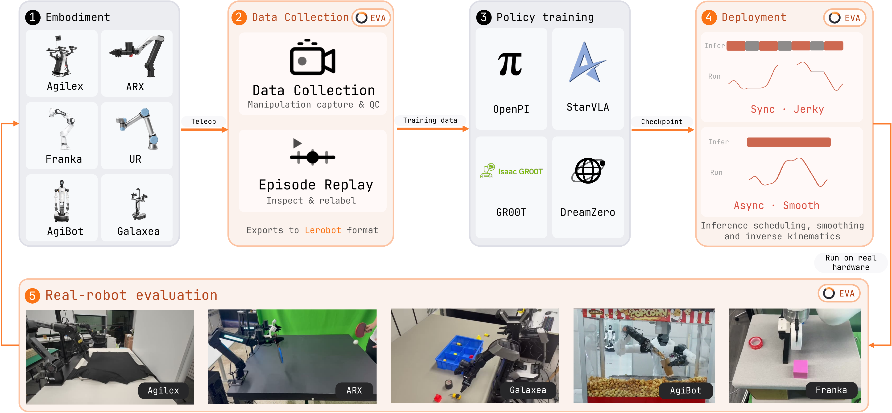

<p align="center">
  <a href="https://colalab.net/projects/eva-client/"></a>
</p>

<h1 align="center">EVA-Client: A Unified Framework for Deployment, Evaluation, and Data Collection on Real Robots</h1>

<p align="center">One policy, any robot — the smooth all-in-one real-robot stack. Debug, record, evaluate, visualize, all in the browser.</p>

<p align="center">
<a href="https://colalab.net/projects/eva-client/"></a>
<a href="https://colalab.net/projects/eva-client/paper/EVA_Client_Report.pdf"></a>
<a href="https://colalab.net/projects/eva-client/docs/introduction.html"></a>
<a href="https://colalab.net/projects/eva-client/docs/introduction.zh.html"></a>
<a href="https://github.com/Noietch/EVA-CLIENT/stargazers"></a>
<p align="center">
  <video src="https://github.com/user-attachments/assets/09cf8c98-396d-45d0-bd38-8603412ec3c2" controls muted></video>
</p>

<p align="center"><em>EVA-Client driving an AgileX bimanual arm end-to-end from the browser — teleop → record → π₀ checkpoint → smooth async deploy. Real hardware, not a rendering.</em></p>

<p align="center">
  <b>Jump to:</b>&nbsp;
  <a href="#-what-you-get">What you get</a> ·
  <a href="#%EF%B8%8F-architecture">Architecture</a> ·
  <a href="#-documentation">Documentation</a> ·
  <a href="#%EF%B8%8F-roadmap">Roadmap</a> ·
  <a href="#-citation">Cite</a>
</p>

---

## ✨ What you get

* **🚀 Deployment.** One command brings up a real-robot closed loop:
  `.py` config → transport ([ROS1](https://github.com/ros/ros) / [ROS2](https://github.com/ros2/ros2) / [ZeroMQ](https://github.com/zeromq/pyzmq) / offline dataset) → policy
  backend ([OpenPI](https://github.com/Physical-Intelligence/openpi), [OpenPI-RTC](https://www.pi.website/research/real_time_chunking), [StarVLA](https://github.com/starVLA/starVLA), [GR00T](https://github.com/Nvidia/Isaac-GR00T), mock, replay) → inference
  strategy (sync / [async](https://github.com/OpenDriveLab/kai0#train-deploy-alignment) / naive / [ACT-ensemble](https://github.com/tonyzhaozh/act) / RTC) with live latency
  compensation. **6 robots already** — joint-space or EEF-space (PyRoki IK),
  all live-switchable from the DEBUG tab.
* **📊 Evaluation.** Multi-checkpoint sweeps with per-trial records: every
  rollout captures camera video, 3D URDF scene, per-dimension state charts,
  and per-prompt milestone scores into dataset metadata, then replays
  synchronously in the RESULT tab. Prompt shuffling, and remote
  policy servers over SSH port-forward are first-class.
* **🎥 Data collection.** Teleop capture straight into [LeRobot](https://github.com/huggingface/lerobot) v2.1 episodes
  from the COLLECT tab — background saver, in-tab QC PASS/FAIL replay, camera
  streams encoded to mp4, per-frame green/red quality flags. Teleop demos and
  model rollouts share one on-disk layout.

---

## 🔥 What's NEW!

* **[2026-07] EVA-Client is open-sourced!** 
* **[2026-07] Paper, docs, and project page are live!** Read the [Technical Report](https://colalab.net/projects/eva-client/paper/EVA_Client_Report.pdf), browse the [Documentation](https://colalab.net/projects/eva-client/docs/introduction.html) ([中文](https://colalab.net/projects/eva-client/docs/introduction.zh.html)), and visit the [Project Page](https://colalab.net/projects/eva-client/).

---

## 🏗️ Architecture

<p align="center">
  
</p>

---

## 📚 Documentation

Full guides live in [`docs/`](./docs). Start here:

| Guide | What's inside |
|-------|---------------|
| [📦 Installation](./docs/installation.md) | Requirements, `uv` setup, hardware extras, verify |
| [🚀 Quick start](./docs/quick-start.md) | Two-process bring-up, supported transports, deploy/eval/replay presets |
| [🧭 Web console](./docs/web-console.md) | The six tabs — MANUAL, COLLECT, REPLAY, DEBUG, EVAL, RESULT |
| [📚 Core concepts](./docs/concepts.md) | Transports, policy backends, inference strategies, robots, action spaces |
| [⚙️ Configuration](./docs/configuration.md) | `_base_` inheritance, deep merge, startup pipeline |
| [🎞️ Recording](./docs/recording.md) | LeRobot v2.1 on-disk layout, QC flags, eval trials |
| [🔬 Development](./docs/development.md) | Tests, lint, type-check, and how the robot side is faked |

---

## 🗺️ Roadmap

- [ ] **More robots.** Extend the robot zoo to more embodiments — dual-arm
      manipulators (YAM, Tianji, …), humanoids
      (Unitree H1/G1, Fourier GR-1, Booster T1, …) and mobile / wheeled
      platforms (mobile ALOHA, Galaxea R1 base, quadruped + arm).
- [ ] **Human-in-the-loop data collection for RL.** Interventions during
      policy rollout captured as preference / correction data, DAgger-style
      relabeling, and reward-model signals piped back through the LeRobot
      episode format for online RL fine-tuning.
- [ ] **Embodied agent.** Wrap the deployment + evaluation loop with a
      language-driven planner (VLM / VLA + tool use) so long-horizon tasks
      can be decomposed, executed, verified, and re-planned end-to-end from
      the same console.
- [ ] **Data annotation.** Extend Collect mode with fine-grained task and
      sub-task annotation, segmenting long-horizon episodes into labeled
      sub-task units and milestones within the same LeRobot dataset. This
      makes a collection reusable at the level of individual manipulation
      phases.

---

## 📝 Citation

If EVA-Client is useful for your research or product, please cite:

```bibtex
@misc{yang2026evaclient,
      title={EVA-Client: A Unified Data Collection, Inference, and Deployment Framework for Embodied Policies on Real Robots}, 
      author={Heqing Yang and Yang Yi and Liyao Wang and Linqing Zhong and Donglin Yang and Ruipu Wu and Zitong Bai and Fengjiao Chen and Manyuan Zhang and Linjiang Huang and Si Liu},
      year={2026},
      eprint={2607.02646},
      archivePrefix={arXiv},
      primaryClass={cs.RO},
      url={https://arxiv.org/abs/2607.02646}, 
}
```

## 📬 Contact

For questions or collaboration, feel free to reach out via WeChat:

<p align="left">
  
</p>

---

<details>
<summary><b>License &amp; Acknowledgements</b></summary>

This project is licensed under the Apache-2.0 License. See [LICENSE](./LICENSE)
for more information.

Builds upon several excellent open-source efforts, including
[PyRoki](https://github.com/chungmin99/pyroki) and
[jaxls](https://github.com/brentyi/jaxls) for kinematics,
[OpenPI](https://github.com/Physical-Intelligence/openpi) for policy serving,
the [LeRobot](https://github.com/huggingface/lerobot) dataset format, and a
vendored mmengine-style config system from
[MMEngine](https://github.com/open-mmlab/mmengine).

</details>
